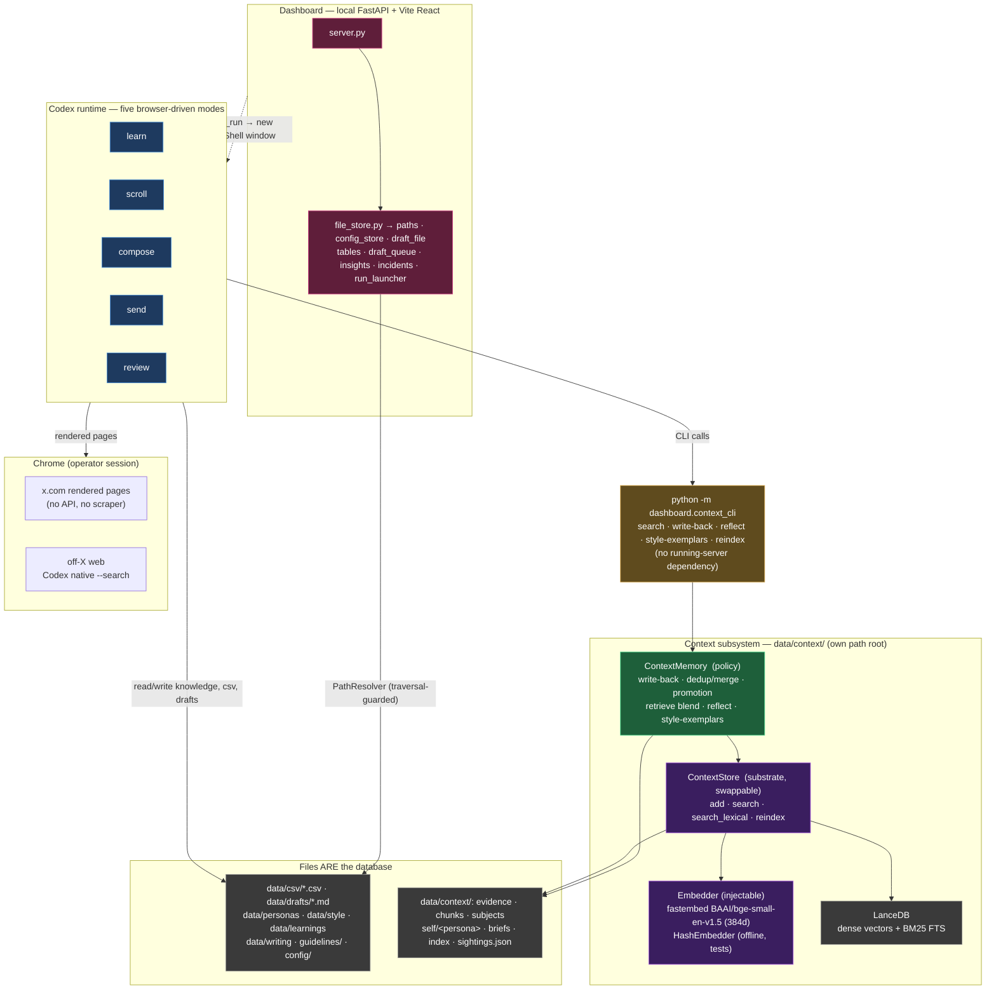
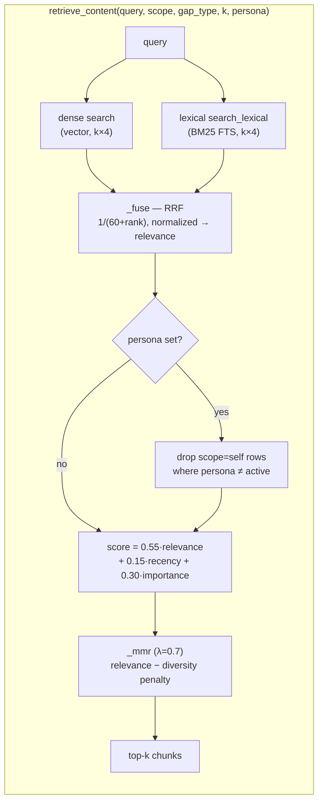
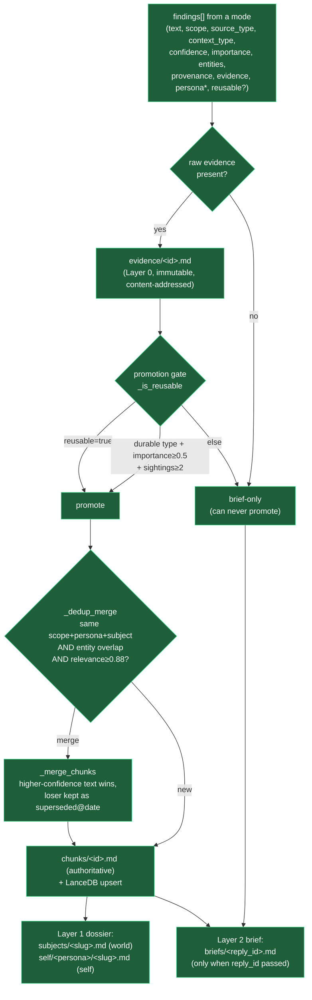
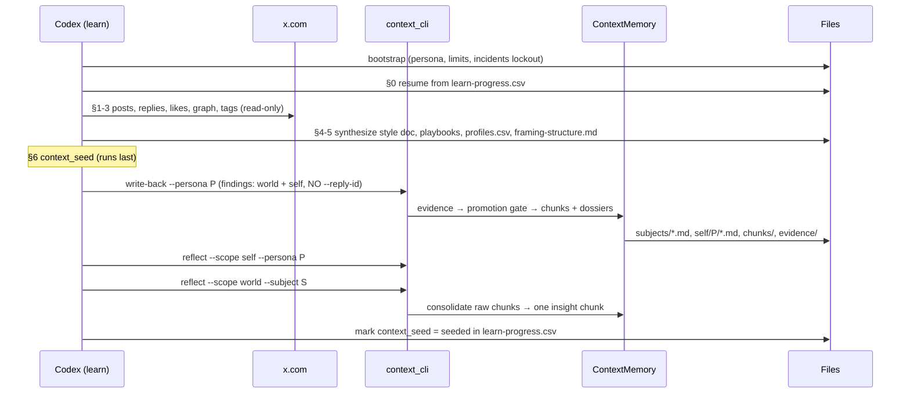
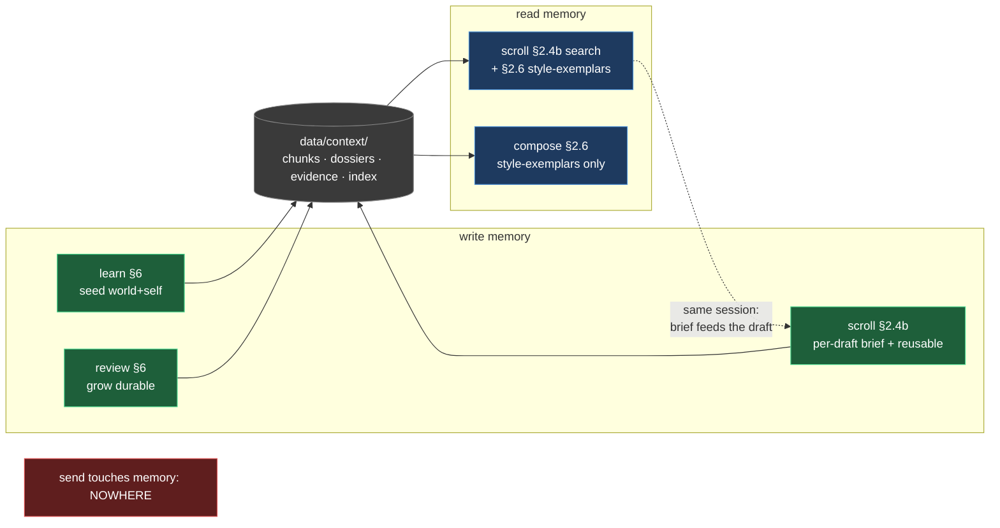

# System Architecture — as built (code-verified)

last_updated: 2026-07-11
status: as-built reference. Every diagram below was verified by reading the actual code (`dashboard/*.py`, `modes/*.md`, `config/*.yaml`, `tests/test_context*.py`), not just the prose docs. Discrepancies between docs and code are listed in the final section.

This is the map to read before running a live loop. It covers: the component architecture, what each of the five runs does, what data is extracted and where it lives, how memory is used across workflows, and the full lifecycle of a single fact from capture to reuse.

---

## 1. Component architecture — the whole system

Two runtimes share one filesystem. **Codex** executes the five modes (browser-driven). The **dashboard** (FastAPI + React) is an editor/view over the same files. There are **two independent path roots**: `PathResolver` guards the classic stores; the context subsystem is rooted separately by `--context-dir`.



**Key facts (verified):**
- Codex reaches memory **only through the CLI** — no shared process, no server. That is why modes can call it from a fresh PowerShell window.
- `ContextStore` is the swappable substrate; `ContextMemory` is the stable policy. All tunables (weights, half-life, thresholds) are **hardcoded defaults in `ContextMemory`** — the CLI does not read them from config.
- The dashboard never touches `data/context/` — memory is grown by the modes, not the editor.

---

## 2. The retrieval + write-back seam (how memory actually works)

The substrate returns raw similarity; **all ranking policy lives in `ContextMemory`**. Retrieval is genuinely hybrid → fused → blended → diversified (this matches the documented formula exactly).



- `recency` = exponential decay, **14-day half-life**; missing/unparseable timestamp → `0.0` (treated as stale, never freshest).
- The **persona post-filter** is the fix that hardened Self isolation on the `scope=None` ("both") draft path — verified present and tested.
- `reflect(scope, persona)` **refuses to run for `scope=self` without a persona** (returns `None`) — cannot mix personas.



\* `persona` is **required for every `scope=self` finding**; `--persona` on the call stamps it defensively.

---

## 3. Data & storage map — what is stored where

```mermaid
flowchart TB
    subgraph L0["data/context — memory (gitignored, own root)"]
        direction TB
        EV["evidence/&lt;id&gt;.md — Layer 0, immutable raw capture"]:::auth
        CH["chunks/&lt;id&gt;.md — authoritative retrievable units"]:::auth
        SUBJ["subjects/&lt;slug&gt;.md — Layer 1 world dossiers"]:::auth
        SELF["self/&lt;persona&gt;/&lt;slug&gt;.md — Layer 1 self dossiers"]:::auth
        BR["briefs/&lt;reply_id&gt;.md — Layer 2 per-draft brief"]:::auth
        SIGHT["sightings.json — promotion counters"]:::auth
        IDX["index/chunks.lance — LanceDB (DERIVED, rebuildable)"]:::derived
    end

    subgraph CSV["data/csv — tabular state (7 tables)"]
        direction TB
        R["replies.csv (28 cols)"]:::auth
        T["tweets.csv (16 cols)"]:::auth
        MET["metrics.csv (23 cols)"]:::auth
        PROF["profiles.csv (17 cols)"]:::auth
        LP["learn-progress.csv (9 cols)"]:::auth
        INC["incidents.csv (10 cols)"]:::auth
        PROV["context-provenance.csv (7 cols) — Layer 3"]:::auth
    end

    subgraph KNOW["knowledge markdown (persona-tuned + shared)"]
        direction TB
        PERS["data/personas/&lt;persona&gt;.md"]:::auth
        STY["data/style/&lt;persona&gt;-twitter-style.md"]:::auth
        LEARN["data/learnings/ (content/engagement/timing playbooks)"]:::auth
        WRIT["data/writing/framing-structure.md (shared, both personas)"]:::auth
        GUIDE["guidelines/ (repo root, not under data/)"]:::auth
    end

    subgraph DRAFTS["data/drafts — queue"]
        DQ["&lt;id&gt;.md → sent/ or discarded/"]:::auth
    end

    subgraph CONF["config + state"]
        APP["config/app.yaml (agent_web_search, data_root)"]:::auth
        LIM["config/limits.yaml (caps)"]:::auth
        MTR["config/metrics.yaml (review capture)"]:::auth
        AG["AGENTS.md active-persona block"]:::auth
        RS["dashboard/run-state.json"]:::auth
    end

    CH -.->|reindex rebuilds| IDX

    classDef auth fill:#2a4a2a,stroke:#6ac06a,color:#fff
    classDef derived fill:#4a2a2a,stroke:#c06a6a,color:#fff
```



**Authoritative vs derived:** every `.md`/`.csv`/`.json` file is source-of-truth. Only `index/chunks.lance` is disposable — `reindex()` rebuilds it from `chunks/*.md` (atomic tmp-table swap). If the vector index is ever lost or corrupt, recovery is one `reindex` away.

**The four memory layers:**
| Layer | Home | Written by | Purpose |
|---|---|---|---|
| 0 evidence | `evidence/` | write-back (only if raw evidence present) | immutable proof; precondition for promotion |
| 1 dossiers | `subjects/`, `self/<persona>/` | promotion path | durable, human-editable per-subject / per-persona knowledge |
| 2 briefs | `briefs/<reply_id>.md` | write-back with `--reply-id` (scroll only) | what a specific draft actually used |
| 3 provenance | `data/csv/context-provenance.csv` | scroll §2.7 (hand-appended today) | analytics join for review (context × engagement) |

---

## 4. What to expect in each run

| Mode | Touches X? | Reads memory? | Writes memory? | Net effect |
|---|---|---|---|---|
| **learn** | read-only | no | **yes** — seeds world + self, no brief | Builds style/profile knowledge **and** warm-starts two-scope memory from history |
| **scroll** | read + 1 research tab | **yes** (search + style-exemplars) | **yes** — brief + reusable chunks | Selects candidates, enriches, drafts replies/quotes, queues them |
| **compose** | read (context only) | yes (style-exemplars via §2.6) | no | Drafts original posts from territory; no per-target brief |
| **send** | read + post | no | no | Human approves each draft; posts char-by-char; captures edits |
| **review** | read | no | **yes** — grows durable memory | Captures delayed metrics, learns, grows world/self memory |

Caps (from `config/limits.yaml`): `max_context_lookups_per_session: 8`, `context_research_time_budget_minutes: 15`, `max_drafts_per_session: 15`, `max_sends_per_day: 8`.

### 4a. `learn` — seeding lifecycle



Three kinds of seed findings, all in one write-back call: **(a) world** = what past items were responding to; **(b) self** = self-facts the persona expressed (`source_type=persona_history`, `persona` required); **(c) content-logic** = *why* they posted → `data/learnings/content-playbook.md`.

### 4b. `scroll` — the tweet-generation lifecycle (the core loop)

```mermaid
sequenceDiagram
    participant C as Codex (scroll)
    participant X as x.com
    participant W as off-X web
    participant CLI as context_cli
    participant F as Files

    C->>X: §1 pull candidates (burst-pause)
    loop each candidate
        C->>F: §2.1-2.2 target filter + dup/staleness guard
        C->>X: §2.3 profile check → profiles.csv
        C->>C: §2.4 format + §2.5 archetype decision
        rect rgb(30,60,40)
        Note over C,CLI: §2.4b Context Brief (gap-gated, archetype-aware)
        C->>C: 1. gap analysis (no gaps → empty brief, skip)
        C->>CLI: 4. search --scope both --persona P --gap-type G (memory first, free)
        C->>X: in-tab read (cheap) / 1 research tab (AGENTS §3.4)
        C->>W: off-X --search (residual world gap; self never web-sourced)
        C->>C: 5. grade sufficiency (stop on good / budget hit)
        C->>CLI: 6. write-back --reply-id R --persona P
        CLI->>F: briefs/R.md + reusable chunks/dossiers + evidence
        end
        rect rgb(40,40,70)
        Note over C,CLI: §2.6 drafting pipeline
        C->>CLI: style-exemplars --persona P --k 5 (diversity, not topic)
        C->>C: 4 passes: voice → style Confirmed → framing/variety → Anti-AI gate
        C->>C: anti-sameness (vs prior drafts) · faithfulness · self-consistency (NLI)
        end
        C->>F: §2.7 replies.csv (drafted) + drafts/R.md + context-provenance.csv row
    end
```

Two hard drafting guards worth noting: **faithfulness** (every atomic claim must trace to a retrieved chunk or `data/company-facts.md`, else `[VERIFY]`/skip) and **context-flex** (the brief informs *what is true*, never *how much the persona appears to know*; a `self` anecdote is allowed only if real `scope=self` memory was retrieved).

### 4c. `send` + `review` — the feedback loop that closes back to memory

```mermaid
sequenceDiagram
    participant Op as Operator (human)
    participant C as Codex
    participant X as x.com
    participant CLI as context_cli
    participant F as Files

    Note over C: send — human-gated
    C->>F: load drafts/*.md oldest-first
    C->>Op: present draft + staleness/tagging flags
    Op->>C: approve / edit / discard  (explicit, per draft)
    C->>X: type char-by-char, post (threads via === self-replies)
    C->>F: replies/tweets.csv (sent, review_due = +5 days), move to drafts/sent/
    C->>F: §4 edit-delta → style doc immediately

    Note over C: review — ≥5 due items, days later
    C->>X: capture Layer-1 (public) + Layer-2 (own-post panel) metrics
    C->>F: append metrics.csv, stamp reviewed_at
    C->>F: §3.6 join metrics × context-provenance.csv (context × engagement)
    C->>F: §3-5 update learnings, profile-rubric, style doc (high-confidence)
    C->>CLI: §6 write-back (grow world+self; engagement ≠ verification)
    C->>CLI: reflect --scope world/self
```

`review_due` is `sent_at + 5 days`. Review's memory growth rule: **self** may grow from sent text, but **world** grows only from preserved evidence or fresh re-verification — never from the mere fact that a post performed well.

---

## 5. How memory is used across workflows



The virtuous loop: **learn seeds → scroll reads at draft time and writes what it used → send posts → review measures and grows memory → next scroll reads richer memory.** Compose is a read-only consumer of style exemplars.

---

## 6. Lifecycle of a single fact

```mermaid
stateDiagram-v2
    [*] --> Captured: mode observes something<br/>(tweet, web result, sent-post outcome)
    Captured --> Evidence: raw bytes → evidence/&lt;id&gt;.md<br/>(content-addressed, immutable)
    Captured --> BriefOnly: no raw evidence
    Evidence --> Gate: promotion gate
    Gate --> BriefOnly: importance&lt;0.5 or sightings&lt;2
    Gate --> Promoted: reusable OR (durable + imp≥0.5 + sightings≥2)
    Promoted --> Chunk: chunks/&lt;id&gt;.md + LanceDB
    Chunk --> Merged: seen again (same scope+persona+subject+entity)
    Merged --> Chunk: higher-confidence wins,<br/>loser → superseded@date
    Chunk --> Dossier: subjects/ or self/&lt;persona&gt;/
    Dossier --> Retrieved: draft time — hybrid+RRF+blend+MMR
    Retrieved --> Consolidated: reflect() → insight chunk<br/>(interim: labeled concat)
    Consolidated --> Retrieved
    Retrieved --> Reused: informs a future draft
    Reused --> Reverified: review re-checks<br/>(engagement ≠ truth)
    Reverified --> Chunk
    BriefOnly --> [*]: lives only in one brief
    Retrieved --> [*]: stale (recency→0) → outranked
```

A fact only becomes durable, cross-draft knowledge if it has **evidence + importance + repetition**. Everything else stays scoped to the single brief it was gathered for — which is what keeps the store from filling with one-off noise.

---

## 7. Documentation accuracy audit (docs vs. code)

The architecture docs are accurate on the load-bearing claims: the retrieval math (`0.55·rel + 0.15·rec + 0.30·imp`, RRF fusion, 14-day half-life, MMR λ=0.7), the ContextStore/ContextMemory seam, persona isolation on both `retrieve_content` and `reflect` (tested), the five CLI subcommands, and file-authoritative storage with a rebuildable index. **37 context tests pass** (96 across the whole suite).

**All eight drifts below were resolved on 2026-07-11** (this table is kept as the record of what was found and how it was fixed):

| # | Severity | Where | Drift | Fix applied |
|---|---|---|---|---|
| 1 | **High** | `modes/review.md` §6 | The §6 write-back **command** omitted `--persona`, though the prose two lines above mandates it for self findings. | Command now reads `write-back --persona <persona>`, with a note to split per-persona if a session reviews items from more than one — mirrors `learn` §6.1. Self isolation now consistent across all three writers. |
| 2 | Med | `scroll.md §2.4b` vs `§2.7`/`review.md §3.6` | **gap-type enum mismatch**: search flag `{identity, factual, temporal, discourse, relational}` vs provenance column `{none, local, discourse, factual, mixed}`. | Provenance `gap_type` redefined as the **rollup of the §2 context-type taxonomy** (`none` \| one type \| `mixed`); the source-ish `local` value dropped (in-tab is a *source*, recorded under `source_types=x_navigation`). Vocabulary now owned once in `guidelines/context-enrichment.md §5.1`; review.md/scroll.md reference it. |
| 3 | Med | `scroll.md` gather vs `review.md §3.6` | **source_types vocab mismatch**: provenance expects `{dossier, x_navigation, x_search, web_search}`; scroll named adapters "memory / in-tab / (b) / (c)". | The 1:1 adapter→token map (`0→dossier, a→x_navigation, b→x_search, c→web_search`) is now documented in `guidelines/context-enrichment.md §5.1`; scroll §2.7 and review §3.6 point at it. |
| 4 | Med | `AGENTS.md §3.5` | `context_research_time_budget_minutes` named as a cap but **no mode enforced it**. | scroll §2.4b (grade step), learn §6.2, and `context-enrichment.md §6` now name it as the research-tab wall-clock sub-budget and stop enriching when it's hit. |
| 5 | Low/Med | `context_store.py` docstring + `CLAUDE.md §6` | ContextStore called "`add`/`search`/`reindex` only" but has a 4th public method **`search_lexical`**. | Docstring and CLAUDE.md §6 now list `add`/`search`/`search_lexical`/`reindex` as "retrieval primitives, no ranking policy." |
| 6 | Low | `CLAUDE.md §6`, `docs/file-map.md` | **`sightings.json`** written but undocumented. | Added to both storage layouts as promotion-counter state. |
| 7 | Low | `CLAUDE.md §6` (Deferred) vs code | "a session runs neither today" was wrong for `reflect()`, whose code path runs. | Reworded: `reflect()` runs today emitting interim *consolidation*; what's deferred is genuine *synthesis*; the ensemble alone is fully unwired. |
| 8 | Low | `compose.md` | compose "applies scroll §2.6 verbatim," but §2.6's brief-dependent checks assume a §2.4b brief compose never produces. | Added compose-specific note (c): faithfulness traces to `company-facts.md`/memory; lived-experience grounding requires an explicit `search --scope self`; no Self hit → no personal claim. |

Also structural (addressed): CLAUDE.md §6 now states that policy tunables are code-owned defaults in `ContextMemory` while session caps are enforced by the modes (documenting the intended seam, not a bug); and `data/writing/` is now surfaced in the dashboard `knowledge_files()` API so the shared framing library is visible/editable there per CLAUDE.md §5.

**Bottom line:** all drifts fixed; **96 tests pass**; only code touches were the `ContextStore` docstring and adding `"writing"` to `knowledge_files()`. Seeding (`learn` → `scroll`) and `review` are now all on consistent, persona-isolated paths. The remaining `docs/roadmap.md` "known follow-ups" (atomic reindex swap, a `provenance` CLI subcommand, LanceDB deprecation migration) are unrelated engineering nice-to-haves, not correctness drifts.
